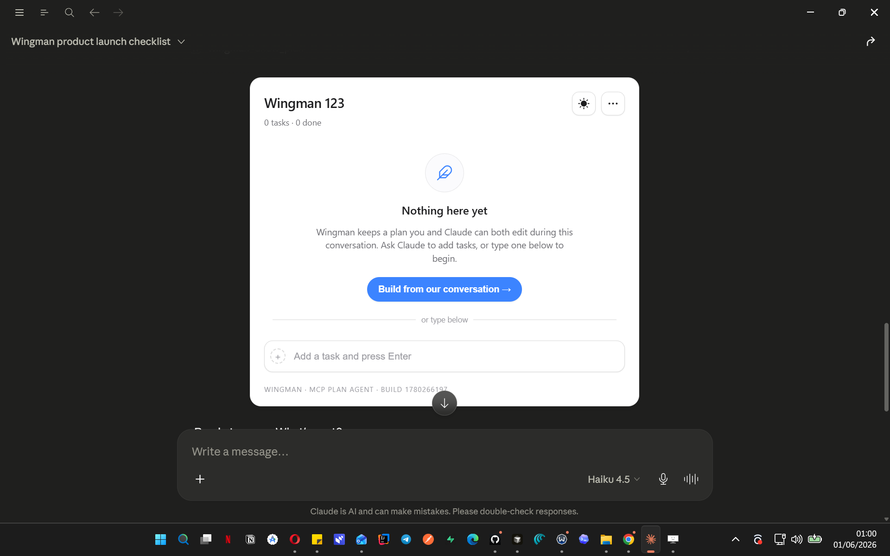
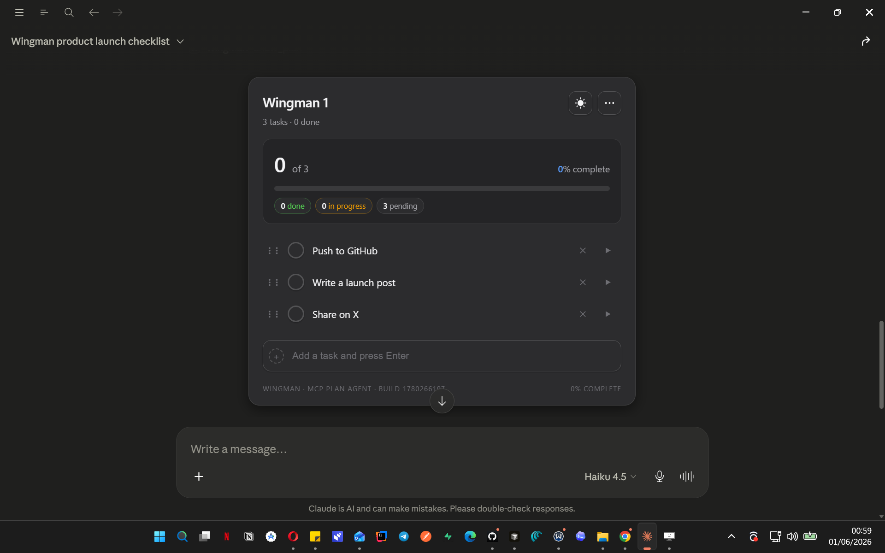
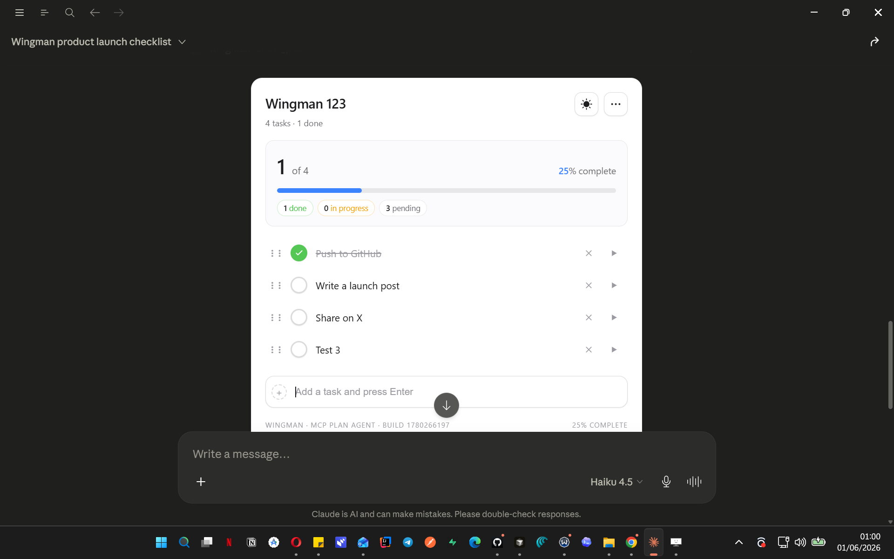
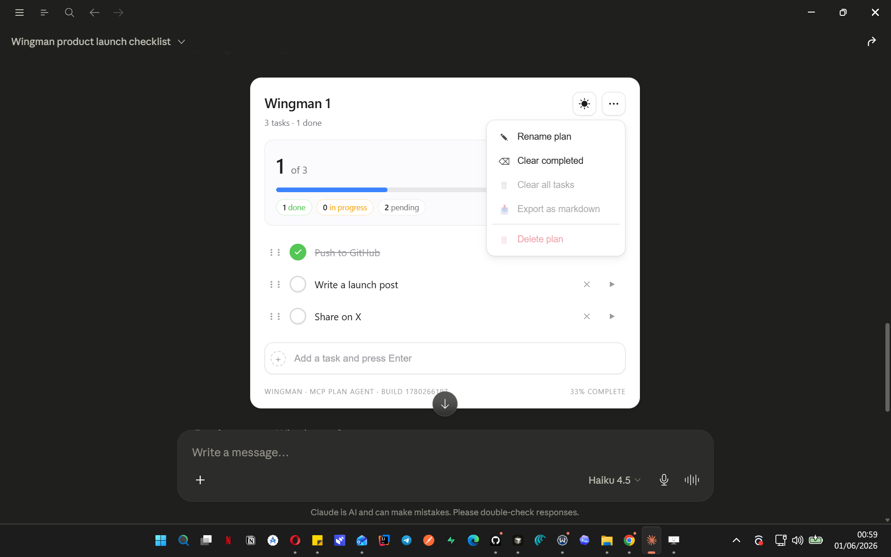

<div align="center">

# Wingman

**An open-source MCP server that gives Claude a persistent, interactive plan panel — rendered inline in the chat.**

_Sits beside you. Doesn't fly the plane._

[](https://pypi.org/project/wingman-mcp/)
[](https://www.python.org/)
[](LICENSE)
[](https://spec.modelcontextprotocol.io)

<br/>


<br/>

</div>

---

## What is Wingman?

Long Claude conversations lose track of what you were doing, what's done, and what's next. Wingman fixes that.

It gives every Claude conversation a **persistent, interactive plan panel** — rendered inline as a live UI widget. You click checkboxes. Claude ticks tasks after completing work. Either of you can add, reorder, or rename tasks at any time. The plan survives conversation restarts and lives in local SQLite on your machine.

Think of it as Cursor's plan agent, generalized to any Claude conversation and any goal.

<br/>

---

## Install

```bash
pip install wingman-mcp
```

Works on Windows, macOS, and Linux. Requires Python 3.10+.

<br/>

---

## Configure

Add Wingman to your MCP host config and restart. One block, one restart.

### Claude Desktop

First, install with pipx for the simplest setup:

```bash
pipx install wingman-mcp
```

Then add to your config (`~/Library/Application Support/Claude/claude_desktop_config.json` on macOS):

```json
{
  "mcpServers": {
    "wingman": {
      "command": "wingman"
    }
  }
}
```

> **Note for pip users:** If you installed with `pip` instead of `pipx`, use the full Python path: `"command": "/Library/Frameworks/Python.framework/Versions/3.12/bin/python3"` with `"args": ["-m", "wingman"]`.

If you installed with `pip` instead, use the full Python path. Find it by running `which python3` in Terminal, then:

```json
{
  "mcpServers": {
    "wingman": {
      "command": "/path/from/which/python3",
      "args": ["-m", "wingman"]
    }
  }
}
```

### Cursor

`.cursor/mcp.json` in your project root, or `~/.cursor/mcp.json` globally:

```json
{
  "mcpServers": {
    "wingman": {
      "command": "python",
      "args": ["-m", "wingman"]
    }
  }
}
```

### VS Code Copilot Chat

`.vscode/mcp.json`:

```json
{
  "servers": {
    "wingman": {
      "type": "stdio",
      "command": "python",
      "args": ["-m", "wingman"]
    }
  }
}
```

### Claude Code (CLI)

Register Wingman once at user scope and it's available in every project:

```bash
claude mcp add wingman -s user -- python -m wingman
```

All tools work in the terminal. Instead of the clickable panel, Wingman renders a
clean text view — a progress bar, your tasks grouped by phase, and checkboxes Claude
ticks as it works:

```text
## Whistler - Full Build
`███████████░░░░░░░░░░░`  32/58 done (55%)
_26 pending_

**PHASE 4**
[ ] 26. Build Play, Pause, Stop playback controls
[ ] 27. Build loop toggle
```

> **Note:** The interactive panel requires a host with MCP Apps support (SEP-1865). Claude Desktop and MCPJam render it fully. Claude Code (CLI), Cursor, and VS Code Copilot Chat receive the clean text view shown above — all tools still work.

<br/>

---

## Wingman Cloud (hosted, sync across devices)

Wingman Cloud is the hosted version: your plans live in one place and sync across
every device and assistant - Claude desktop, web, and mobile, and ChatGPT - so a
plan you build on your laptop is right there on your phone.

**Connect it (one time):**

1. In Claude, open **Settings -> Connectors -> Add custom connector** (on ChatGPT,
   add it as a custom MCP connector).
2. Enter the server URL:

   ```text
   https://wingman-mcp.onrender.com/mcp
   ```

3. A browser window opens to sign in with Google or email. Approve it, and you are
   connected. You only do this once per device; you stay signed in afterward.

That's it - create a plan on one device and it shows up on the others. The
interactive panel renders where the host supports it (Claude desktop today), and
the clean text view is used everywhere else.

> Wingman Cloud is in early hosted beta. The local `pip install wingman` stays
> fully supported and zero-telemetry; the hosted service adds accounts and
> cross-device sync (see Security & privacy below).

<br/>

---

## How it works

### 1. Build a plan with Claude

Just describe what you're working on. Claude creates the plan and renders the panel inline:

```
You: I want to ship Wingman this weekend — README, PyPI, GitHub, launch post.
     Create a plan.

Claude: [calls create_plan → panel mounts with tasks already populated]
```

### 2. Start with an empty plan, let Claude fill it

```
You: Create an empty plan called "Wingman launch"

Claude: [panel mounts showing the empty state]
```

Hit **Build from our conversation →** in the panel. Claude scans your chat history and populates tasks from what you've already discussed.

### 3. Work through it together

- **Click a checkbox** to tick a task manually
- **Click ▶ Run** on any task to send it back to Claude as a framed prompt — Claude works on it and ticks it when done
- **Drag the ⋮⋮ handle** to reorder tasks as priorities shift
- **Click the title** to rename the plan inline
- Tasks persist in local SQLite — survive restarts, survive new conversations

<br/>

---

## Screenshots

<table>
<tr>
<td width="50%">

**Empty state — ready to build**

The panel mounts with a feather icon and a single CTA. One click scans your conversation and populates tasks.

</td>
<td width="50%">

**Populated plan**

Progress card, task list with checkboxes, drag handles, and run buttons. Always visible, never hover-only.

</td>
</tr>
<tr>
<td>



</td>
<td>



</td>
</tr>
<tr>
<td width="50%">

**Task ticked — progress updates live**

Checkbox turns green, strikethrough applied, progress bar advances. State syncs via live polling across any open panels.

</td>
<td width="50%">

**3-dot menu**

Rename plan, Clear completed, Build from conversation, Clear all tasks, Export as markdown, and Delete plan.

</td>
</tr>
<tr>
<td>



</td>
<td>



</td>
</tr>
</table>

<br/>

---

## Tool reference

Wingman exposes 12 tools to Claude. You don't call these directly — just describe what you want and Claude picks the right one.

| Tool                 | What it does                                               |
| -------------------- | ---------------------------------------------------------- |
| `create_plan`        | Create a new named plan with optional initial tasks        |
| `show_plan`          | Render the interactive panel inline in chat                |
| `show_plans`         | Render a clickable plan picker inline in chat              |
| `get_plan`           | Return plan state as formatted text (no panel)             |
| `add_task`           | Append a single task to a plan                             |
| `add_tasks`          | Append multiple tasks in one call                          |
| `tick_task`          | Mark a task done (Claude calls this after completing work) |
| `update_task_status` | Set status: `pending` / `in_progress` / `done` / `blocked` |
| `rename_plan`        | Rename a plan                                              |
| `reorder_tasks`      | Reorder tasks by ID list                                   |
| `list_plans`         | List all plans with task counts                            |
| `delete_plan`        | Delete a plan and all its tasks                            |

There are also 14 internal `_ui_*` tools used by the panel itself — hidden from Claude, not part of the public API.

<br/>

---

## Use as an agent skill

Wingman is available as a composable skill for AI agents via [skills.sh](https://skills.sh):

```bash
npx skills add adeoluwaadesina/wingman-mcp
```

Once installed, any MCP-compatible agent can call Wingman's plan management tools as coordination primitives across a multi-step workflow — create plans, track task state, and tick tasks on completion, all from within an orchestrated agent pipeline.

<br/>

---

## Architecture

```
┌─────────────────────────────────────────────────────┐
│  MCP Host  (Claude Desktop / Cursor / MCPJam)        │
│                                                      │
│  ┌──────────────┐     ┌──────────────────────────┐  │
│  │  Claude LLM  │────▶│  Wingman MCP Server       │  │
│  └──────────────┘     │  (stdio transport)        │  │
│         ▲             │                            │  │
│         │             │  12 LLM-visible tools      │  │
│  sendMessage()        │  14 UI-only tools          │  │
│         │             │  ui:// resource (panel)    │  │
│  ┌──────────────┐     │  SQLite store              │  │
│  │  Wingman     │◀────│                            │  │
│  │  Panel       │     └──────────────────────────┘  │
│  │  (iframe)    │  JSON-RPC over postMessage         │
│  └──────────────┘                                    │
└─────────────────────────────────────────────────────┘
                              │
               platformdirs.user_data_dir()
                              │
                         plans.db (SQLite)
```

**Stack:** Python 3.10+, FastMCP, SQLite + platformdirs, vanilla HTML/CSS/JS, Sortable.js. No external runtime network calls anywhere.

<br/>

---

## Security & privacy

- **No telemetry. No phone-home. No network calls anywhere.** Wingman is a local state-tracking server. Zero outbound connections on any tool path — audited and tested.
- **Local-only by default.** stdio transport. Your plans live on your machine.
- **Local vs Cloud.** The no-telemetry guarantee above covers the local `pip install` product, which stays zero-network. The forthcoming hosted **Wingman Cloud** service (in active development) is a separate, opt-in deployment: it stores plans in Postgres (Neon) and uses server-side analytics (Sentry, PostHog) purely to operate the service. It never logs plan or task content. Using the local install never touches any of that.
- **Sandboxed UI.** The panel runs in a host-sandboxed iframe with a strict CSP (`connect-src 'self'`). No cross-origin access.
- **Parameterized SQL throughout.** No string-built queries. Validated via full test suite.
- **Path-traversal safe.** Plan names are allow-list validated — letters, digits, space, hyphen, underscore, apostrophe, period, colon, parentheses. Slashes, backslashes, `..` sequences, null bytes, newlines, and tabs are blocked.

<br/>

---

## vs. alternatives

|                          | Wingman          | text-only MCP todos | Cursor plan agent |
| ------------------------ | ---------------- | ------------------- | ----------------- |
| Interactive UI panel     | ✅ inline iframe | ❌                  | ✅ code-only      |
| Works in Claude Desktop  | ✅               | ✅                  | ❌                |
| One-click Run task       | ✅               | ❌                  | ✅                |
| Build from conversation  | ✅               | ❌                  | ❌                |
| Drag-to-reorder          | ✅               | ❌                  | ❌                |
| Persists across restarts | ✅ SQLite        | varies              | ❌                |
| Any goal / domain        | ✅               | ✅                  | ❌ code only      |
| No telemetry             | ✅               | varies              | ❌                |

<br/>

---

## Known limitations in v0.2

- **Live polling** runs every 2.5s (10s after 30s idle). Server-pushed updates via MCP notifications are v0.3.
- **Mobile Claude** (claude.ai mobile) requires a hosted HTTP/SSE server. Local stdio can't reach mobile clients. Wingman Cloud addresses this.

<br/>

---

## Roadmap

### Wingman Cloud — next

HTTP/SSE transport · OAuth 2.1 · Postgres with user scoping · Render / Railway hosting · mobile Claude support · cross-device plan access

The Foundation (multi-tenant Postgres storage, OAuth 2.1 resource-server auth, transport hardening) is in active development. Run it locally with `wingman-cloud` once the required env vars (see `.env.example`) are set.

### v0.2 — shipped ✓

Plan picker (`show_plans`) · full menu actions (clear all, export, delete) · per-plan task numbering · wider plan-name support (`'.:()`) · smarter polling backoff · "Build from conversation" in 3-dot menu

<br/>

---

## Development troubleshooting

**Panel doesn't appear after code changes:**
The served HTML is cached in memory for the subprocess lifetime. Restart Claude Desktop fully (quit from tray, don't just close the window) after any change to `ui/static/*`. Hard-refresh the host webview (Ctrl+Shift+R in MCPJam) after restart. The build timestamp in the panel footer confirms which build is live.

**Tools don't appear after config change:**
Quit Claude Desktop fully — closing the window leaves the MCP subprocess running with the old config.

**`wingman --help` shows an MCP protocol error:**
Expected. Wingman is an MCP server, not a CLI tool. It speaks JSON-RPC over stdio — running it directly in a terminal produces a protocol handshake error. Use it via your MCP host config.

<br/>

---

## Contributing

Issues, PRs, and feedback welcome. This is v0.2 — rough edges exist and are documented above.

If you hit a host-specific rendering quirk (especially on Cursor or VS Code Copilot Chat), open an issue with your host version and what you observed. Host-side MCP Apps behavior varies and real-world reports are the fastest way to track it.

<br/>

---

## License

MIT — © 2026 Adeolu Adesina

---

<div align="center">

Built with [FastMCP](https://github.com/jlowin/fastmcp) · Powered by [MCP Apps (SEP-1865)](https://spec.modelcontextprotocol.io) · Published on [PyPI](https://pypi.org/project/wingman-mcp/)

</div>
