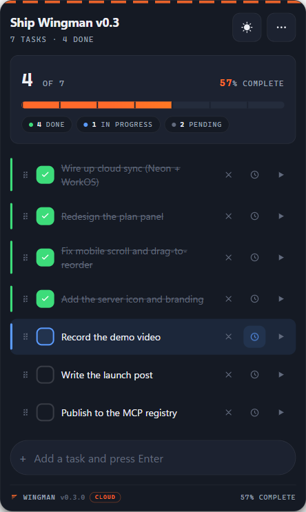
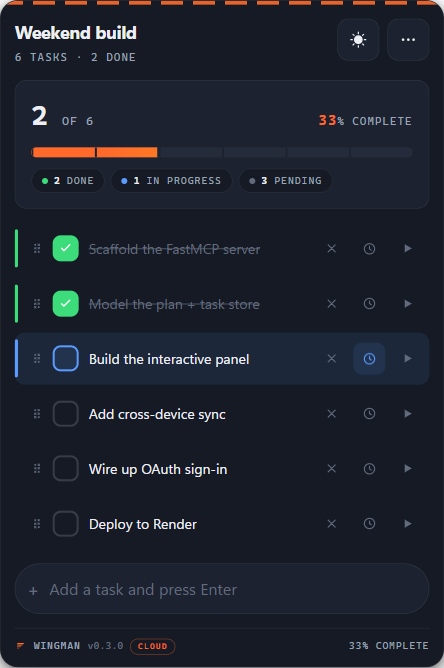
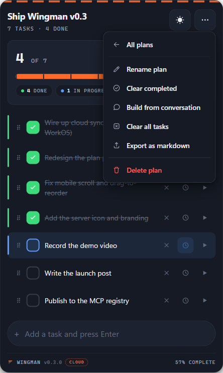
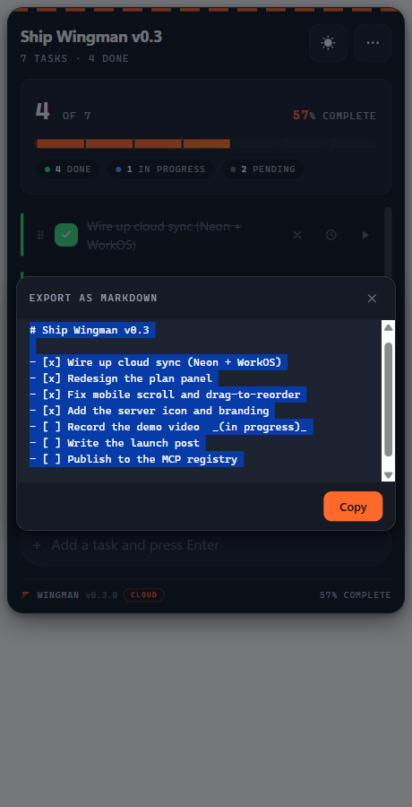
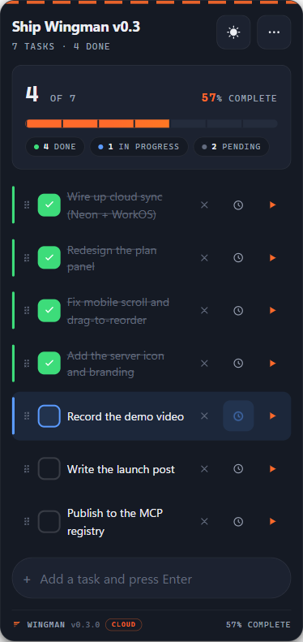
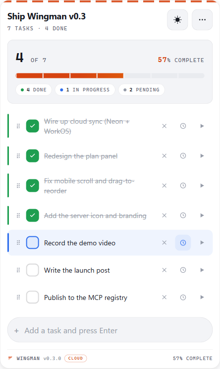

<div align="center">

# Wingman

**An open-source MCP server that gives your AI a persistent, interactive plan panel - rendered inline in the chat, and now synced across every device.**

_Sits beside you. Doesn't fly the plane._

[](https://pypi.org/project/wingman-mcp/)
[](https://www.python.org/)
[](LICENSE)
[](https://spec.modelcontextprotocol.io)

<br/>


<br/>

</div>

---

## What is Wingman?

Long Claude conversations lose track of what you were doing, what's done, and what's next. Wingman fixes that.

It gives every Claude conversation a **persistent, interactive plan panel** - rendered inline as a live UI widget. You click checkboxes. Claude ticks tasks after completing work. Either of you can add, reorder, or rename tasks at any time. The plan survives conversation restarts and lives in local SQLite on your machine.

Think of it as Cursor's plan agent, generalized to any AI conversation and any goal.

<br/>

---

## New in v0.3

- **Wingman Cloud, live.** A hosted, multi-tenant server so your plans sync across every device and assistant. Build a plan on your laptop, it is on your phone. [Connect it](#wingman-cloud-hosted-sync-across-devices) with one URL.
- **Redesigned panel.** A "flight-ops instrument" look: signal-orange on night-navy, mono readouts, a notched progress tape, and a status rail that shows task state at a glance.
- **In-progress status.** Mark a task as in-flight (a gently pulsing beacon), not just done or not-done. `pending -> in_progress -> done`.
- **In-panel markdown export.** Export a plan to markdown in a copy sheet right in the panel (no chat injection, no host warnings).
- **Mobile-optimized.** Bigger tap targets, a reachable top menu, a visible delete control, and smooth touch scrolling.
- **A real identity.** A new Wingman brand mark ("Manifest") ships as the panel logo, the favicon, and the MCP server icon.

<br/>

---

## Install

```bash
pip install wingman-mcp
```

Works on Windows, macOS, and Linux. Requires Python 3.10+.

<br/>

---

## Configure

Add Wingman to your MCP host config and restart. One block, one restart.

### Claude Desktop

First, install with pipx for the simplest setup:

```bash
pipx install wingman-mcp
```

Then add to your config (`~/Library/Application Support/Claude/claude_desktop_config.json` on macOS):

```json
{
  "mcpServers": {
    "wingman": {
      "command": "wingman"
    }
  }
}
```

> **Note for pip users:** If you installed with `pip` instead of `pipx`, use the full Python path: `"command": "/Library/Frameworks/Python.framework/Versions/3.12/bin/python3"` with `"args": ["-m", "wingman"]`.

If you installed with `pip` instead, use the full Python path. Find it by running `which python3` in Terminal, then:

```json
{
  "mcpServers": {
    "wingman": {
      "command": "/path/from/which/python3",
      "args": ["-m", "wingman"]
    }
  }
}
```

### Cursor

`.cursor/mcp.json` in your project root, or `~/.cursor/mcp.json` globally:

```json
{
  "mcpServers": {
    "wingman": {
      "command": "python",
      "args": ["-m", "wingman"]
    }
  }
}
```

### VS Code Copilot Chat

`.vscode/mcp.json`:

```json
{
  "servers": {
    "wingman": {
      "type": "stdio",
      "command": "python",
      "args": ["-m", "wingman"]
    }
  }
}
```

### Claude Code (CLI)

Register Wingman once at user scope and it's available in every project:

```bash
claude mcp add wingman -s user -- python -m wingman
```

All tools work in the terminal. Instead of the clickable panel, Wingman renders a
clean text view - a progress bar, your tasks grouped by phase, and checkboxes Claude
ticks as it works:

```text
## Whistler - Full Build
`███████████░░░░░░░░░░░`  32/58 done (55%)
_26 pending_

**PHASE 4**
[ ] 26. Build Play, Pause, Stop playback controls
[ ] 27. Build loop toggle
```

> **Note:** The interactive panel requires a host with MCP Apps support (SEP-1865). Claude Desktop and MCPJam render it fully. Claude Code (CLI), Cursor, and VS Code Copilot Chat receive the clean text view shown above - all tools still work.

<br/>

---

## Wingman Cloud (hosted, sync across devices)

Wingman Cloud is the hosted version: your plans live in one place and sync across
every device and assistant - Claude desktop, web, and mobile, and ChatGPT - so a
plan you build on your laptop is right there on your phone.

**Connect it (one time):**

1. In Claude, open **Settings -> Connectors -> Add custom connector** (on ChatGPT,
   add it as a custom MCP connector).
2. Enter the server URL:

   ```text
   https://wingman-mcp.onrender.com/mcp
   ```

3. A browser window opens to sign in with Google or email. Approve it, and you are
   connected. You only do this once per device; you stay signed in afterward.

That's it - create a plan on one device and it shows up on the others. The
interactive panel renders where the host supports it (Claude desktop and ChatGPT
today), and the clean text view is used everywhere else.

> Wingman Cloud is in early hosted beta. The local `pip install wingman` stays
> fully supported and zero-telemetry; the hosted service adds accounts and
> cross-device sync (see Security & privacy below).

<br/>

---

## Use Wingman in ChatGPT

ChatGPT can connect to Wingman Cloud as a custom MCP connector. Tools work
immediately, and the interactive panel renders inline when you ask ChatGPT to
show a plan.

> Requires a ChatGPT **Plus, Pro, Business, or Enterprise/Edu** account on
> **web** (Developer Mode is not available on the mobile apps).

**1. Turn on Developer Mode**

1. Click your profile picture (bottom-left) -> **Settings**.
2. Open **Apps & Connectors** in the left rail.
3. Scroll to the bottom, open **Advanced settings**, and toggle **Developer
   mode** on. (Shortcut once you are in ChatGPT: `Ctrl` + `.`)

**2. Add Wingman as a connector**

1. Back on **Apps & Connectors**, click **Create** (add custom connector).
2. Fill in the fields. Unlike Claude, ChatGPT asks you to set the icon and
   description by hand:
   - **Name:** `Wingman`
   - **MCP Server URL:** `https://wingman-mcp.onrender.com/mcp`
   - **Authentication:** OAuth
   - **Icon:** download [`docs/assets/wingman-icon.png`](docs/assets/wingman-icon.png)
     and upload it.
   - **Description:** paste
     > Wingman gives your chat a persistent, interactive plan and to-do panel.
     > Create named plans, add and tick off tasks, mark work in progress, and
     > track it all on a live panel. Plans sync across your devices and
     > assistants, so a plan you start here is there in Claude too.
3. Save, then sign in with Google or email when the OAuth window opens. You only
   do this once per device.

**3. Use it**

Start a **new chat** (Developer Mode tools only appear in chats opened after you
connect), then try:

> Use Wingman to create a plan called "Launch" with three tasks: draft, review,
> ship. Then show me the plan.

The plan syncs with the same account you use in Claude, so anything you build in
ChatGPT is on your other devices too.

> First call after an idle spell can take a few seconds - the hosted service runs
> on a free tier that sleeps when idle, then wakes and is fast.

<br/>

---

## How it works

### 1. Build a plan with Claude

Just describe what you're working on. Claude creates the plan and renders the panel inline:

```
You: I want to ship Wingman this weekend - README, PyPI, GitHub, launch post.
     Create a plan.

Claude: [calls create_plan → panel mounts with tasks already populated]
```

### 2. Start with an empty plan, let Claude fill it

```
You: Create an empty plan called "Wingman launch"

Claude: [panel mounts showing the empty state]
```

Hit **Build from our conversation →** in the panel. Claude scans your chat history and populates tasks from what you've already discussed.

### 3. Work through it together

- **Click a checkbox** to tick a task manually
- **Mark a task in-progress** to show what is in flight (a pulsing beacon), distinct from done
- **Click ▶ Run** on any task to send it back to your assistant as a framed prompt - it works on it and ticks it when done
- **Drag the ⋮⋮ handle** to reorder tasks as priorities shift (press and hold on touch)
- **Click the title** to rename the plan inline
- **Export as markdown** from the menu into an in-panel copy sheet
- Tasks persist across restarts and new conversations (local SQLite, or Neon Postgres on Cloud)

<br/>

---

## Screenshots

<table>
<tr>
<td width="50%">

**Populated plan**

The flight-ops panel: a notched progress tape, a status rail on each row, checkboxes, drag handles, and run buttons. Always visible, never hover-only.

</td>
<td width="50%">

**Live status**

Tasks check off with an animated settle; the big percent counts up; an in-flight task pulses. State syncs via live polling across any open panels.

</td>
</tr>
<tr>
<td>



</td>
<td>



</td>
</tr>
<tr>
<td width="50%">

**3-dot menu**

Rename plan, Clear completed, Build from conversation, Clear all tasks, Export as markdown, and Delete plan - a reachable dropdown on every device.

</td>
<td width="50%">

**Export as markdown**

Export a plan to markdown in an in-panel copy sheet - one tap to grab the whole checklist, no host warnings, no leaving the panel.

</td>
</tr>
<tr>
<td>



</td>
<td>



</td>
</tr>
<tr>
<td width="50%">

**On your phone**

The same panel reflows for touch: bigger checkboxes, an always-visible delete control, run and in-progress buttons on every row, and a list that grows so the page scrolls naturally.

</td>
<td width="50%">

**Light or dark**

Follows your theme automatically, and the sun toggle cycles auto - light - dark. The orange runway accent carries across both.

</td>
</tr>
<tr>
<td>



</td>
<td>



</td>
</tr>
</table>

> These are the live panel rendered exactly as it appears in Claude. Asset files live in [`docs/assets/`](docs/assets/); the animated hero loop and 3-step connect GIF are captured from the explainer per [`docs/launch/connect-walkthrough.md`](docs/launch/connect-walkthrough.md).

<br/>

---

## Tool reference

Wingman exposes 12 tools to Claude. You don't call these directly - just describe what you want and Claude picks the right one.

| Tool                 | What it does                                               |
| -------------------- | ---------------------------------------------------------- |
| `create_plan`        | Create a new named plan with optional initial tasks        |
| `show_plan`          | Render the interactive panel inline in chat                |
| `show_plans`         | Render a clickable plan picker inline in chat              |
| `get_plan`           | Return plan state as formatted text (no panel)             |
| `add_task`           | Append a single task to a plan                             |
| `add_tasks`          | Append multiple tasks in one call                          |
| `tick_task`          | Mark a task done (Claude calls this after completing work) |
| `update_task_status` | Set status: `pending` / `in_progress` / `done` / `blocked` |
| `rename_plan`        | Rename a plan                                              |
| `reorder_tasks`      | Reorder tasks by ID list                                   |
| `list_plans`         | List all plans with task counts                            |
| `delete_plan`        | Delete a plan and all its tasks                            |

There are also 14 internal `_ui_*` tools used by the panel itself - hidden from Claude, not part of the public API.

<br/>

---

## Use as an agent skill

Wingman is available as a composable skill for AI agents via [skills.sh](https://skills.sh):

```bash
npx skills add adeoluwaadesina/wingman-mcp
```

Once installed, any MCP-compatible agent can call Wingman's plan management tools as coordination primitives across a multi-step workflow - create plans, track task state, and tick tasks on completion, all from within an orchestrated agent pipeline.

<br/>

---

## Architecture

```
┌─────────────────────────────────────────────────────┐
│  MCP Host  (Claude Desktop / Cursor / MCPJam)        │
│                                                      │
│  ┌──────────────┐     ┌──────────────────────────┐  │
│  │  Claude LLM  │────▶│  Wingman MCP Server       │  │
│  └──────────────┘     │  (stdio transport)        │  │
│         ▲             │                            │  │
│         │             │  12 LLM-visible tools      │  │
│  sendMessage()        │  14 UI-only tools          │  │
│         │             │  ui:// resource (panel)    │  │
│  ┌──────────────┐     │  SQLite store              │  │
│  │  Wingman     │◀────│                            │  │
│  │  Panel       │     └──────────────────────────┘  │
│  │  (iframe)    │  JSON-RPC over postMessage         │
│  └──────────────┘                                    │
└─────────────────────────────────────────────────────┘
                              │
               platformdirs.user_data_dir()
                              │
                         plans.db (SQLite)
```

**Stack:** Python 3.10+, FastMCP, SQLite + platformdirs, vanilla HTML/CSS/JS, Sortable.js. No external runtime network calls anywhere.

<br/>

---

## Security & privacy

- **No telemetry. No phone-home. No network calls anywhere.** Wingman is a local state-tracking server. Zero outbound connections on any tool path - audited and tested.
- **Local-only by default.** stdio transport. Your plans live on your machine.
- **Local vs Cloud.** The no-telemetry guarantee above covers the local `pip install` product, which stays zero-network. The forthcoming hosted **Wingman Cloud** service (in active development) is a separate, opt-in deployment: it stores plans in Postgres (Neon) and uses server-side analytics (Sentry, PostHog) purely to operate the service. It never logs plan or task content. Using the local install never touches any of that.
- **Sandboxed UI.** The panel runs in a host-sandboxed iframe with a strict CSP (`connect-src 'self'`). No cross-origin access.
- **Parameterized SQL throughout.** No string-built queries. Validated via full test suite.
- **Path-traversal safe.** Plan names are allow-list validated - letters, digits, space, hyphen, underscore, apostrophe, period, colon, parentheses. Slashes, backslashes, `..` sequences, null bytes, newlines, and tabs are blocked.
- **Privacy policy.** Full details of what each edition collects, stores, and shares are in [PRIVACY.md](PRIVACY.md). Short version: the local edition keeps everything on your machine; the hosted edition stores only your account identity and your plans/tasks, never sells data, and never trains models on it.

<br/>

---

## vs. alternatives

|                          | Wingman          | text-only MCP todos | Cursor plan agent |
| ------------------------ | ---------------- | ------------------- | ----------------- |
| Interactive UI panel     | ✅ inline iframe | ❌                  | ✅ code-only      |
| Works in Claude Desktop  | ✅               | ✅                  | ❌                |
| One-click Run task       | ✅               | ❌                  | ✅                |
| Build from conversation  | ✅               | ❌                  | ❌                |
| Drag-to-reorder          | ✅               | ❌                  | ❌                |
| Persists across restarts | ✅ SQLite        | varies              | ❌                |
| Any goal / domain        | ✅               | ✅                  | ❌ code only      |
| No telemetry             | ✅               | varies              | ❌                |

<br/>

---

## Known limitations in v0.3

- **Live polling** runs every 2.5s (10s after 30s idle). Server-pushed updates via MCP notifications are still on the list.
- **Cold start on Cloud.** The hosted service runs on a free tier that sleeps when idle; the first request after a lull takes a few seconds to wake it, then it is fast.
- **Server icon rendering** depends on the host. Wingman advertises its brand mark in the MCP server identity; whether a client shows it next to tool calls (vs a "W" initial) is up to that client.

<br/>

---

## Roadmap

### Wingman Cloud - shipped ✓

Streamable-HTTP transport · OAuth 2.1 resource server (WorkOS AuthKit) · multi-tenant Postgres (Neon) with per-user scoping · Render hosting · mobile + cross-device sync · content-free operator metrics. Run it yourself with `wingman-cloud` once the env vars in `.env.example` are set, or use the hosted instance above.

### Next

Server-pushed updates (MCP notifications instead of polling) · keep-warm ping · Wingman Wrapped (a year-in-review from content-free metrics) · richer status filters.

### v0.3 - shipped ✓

Wingman Cloud (hosted sync) · redesigned flight-ops panel · in-progress task status · in-panel markdown export · mobile-optimized layout · Wingman brand mark (panel logo, favicon, MCP server icon).

### v0.2 - shipped ✓

Plan picker (`show_plans`) · full menu actions (clear all, export, delete) · per-plan task numbering · wider plan-name support (`'.:()`) · smarter polling backoff · "Build from conversation" in 3-dot menu

<br/>

---

## Development troubleshooting

**Panel doesn't appear after code changes:**
The served HTML is cached in memory for the subprocess lifetime. Restart Claude Desktop fully (quit from tray, don't just close the window) after any change to `ui/static/*`. Hard-refresh the host webview (Ctrl+Shift+R in MCPJam) after restart. The build timestamp in the panel footer confirms which build is live.

**Tools don't appear after config change:**
Quit Claude Desktop fully - closing the window leaves the MCP subprocess running with the old config.

**`wingman --help` shows an MCP protocol error:**
Expected. Wingman is an MCP server, not a CLI tool. It speaks JSON-RPC over stdio - running it directly in a terminal produces a protocol handshake error. Use it via your MCP host config.

<br/>

---

## Contributing

Issues, PRs, and feedback welcome. This is v0.3 - rough edges exist and are documented above.

If you hit a host-specific rendering quirk (especially on Cursor or VS Code Copilot Chat), open an issue with your host version and what you observed. Host-side MCP Apps behavior varies and real-world reports are the fastest way to track it.

<br/>

---

## License

MIT - © 2026 Adeolu Adesina

---

<div align="center">

Built with [FastMCP](https://github.com/jlowin/fastmcp) · Powered by [MCP Apps (SEP-1865)](https://spec.modelcontextprotocol.io) · Published on [PyPI](https://pypi.org/project/wingman-mcp/)

</div>
